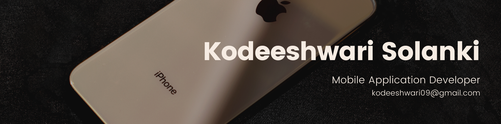

  

  Innovative Mobile App Developer | IT Programmer Analyst

  
  

Hey there! 👋 I'm Kodeeshwari Solanki, an graduated IT Programmer Analyst from Lasalle College with a passion for mobile app development. I'm on a journey to become a skilled Mobile App Developer, and I love creating intuitive and delightful mobile experiences.

## About Me

- 🎓 **Education:** IT Programmer Analyst at Lasalle College
- 💼 **Job:** Seeking for good mobile developer(iOS, Flutter) opportunity
- 🌱 **Learning:** Flutter, Swift, iOS development, Android Development, Web Development, UI/UX design
- 😄 **Pronouns:** She/Her

## Skills

- 💻 **Programming Languages:**
  Dart, Swift, Python, Java, PHP, JavaScript, C, C#, C++, SQL, OOP Concept, MVC Architectural.

- 📱 **Mobile Technologies:**
  Flutter, iOS and Android app development.
  
- 🌐 **Web Technologies:**
  React.JS, Node.JS, Laravel, ECMAScript, HTML, CSS, Bootstrap, Ajax, jQuery, RESTful, JSON, Web Animation, WordPress, jQuery.
  
- 🗃️ **Database:**
  MySQL, SQL Server, Firebase, SQLite, Oracle (PL/SQL), MongoDB, Workbench.
  
- 🛠️ **Software:**
  Xcode, Visual Studio Code, Android Studio, IntelliJ IDEA, Django, XAMPP, Postman, FileZilla, Trello, Slack, Adobe XD, Figma.
  
- 🚀 **Deployment:**
  GitHub, Netlify, Hostinger, GoDaddy.
  
- 🎨 **Design:**
  UI/UX, Web and Mobile UI Wireframe, Logo Design, social media Banner.

## Projects

1. **Weather To Wear (iOS app) - Academic Project**
   Description: [Brief description of the Weather To Wear app.](https://github.com/Kodeeshwari/WeatherToWear)
   
2. **Todo App (Flutter app) - Portfolio Project**
   Description: [Brief description of the Todo App.]
   
3. **Flash Chat (iOS app) - Portfolio Project**
   Description: [Brief description of the Flash Chat App.](https://github.com/Kodeeshwari/Flash-Chat-iOS-App)

## Let's Connect

- 📧 **Email:** kodeeshwari09@gmail.com
- 💼 **Portfolio:** [Kodeeshwari Portfolio](https://kodeeshwari.me/)
- 💼 **LinkedIn:** [Your LinkedIn Profile](https://linkedin.com/in/kodeeshwari/)
- 💻 **GitHub:** [Your GitHub Profile](https://github.com/Kodeeshwari)

Feel free to connect with me! Let's learn and grow together in the amazing world of mobile app development. 🚀
